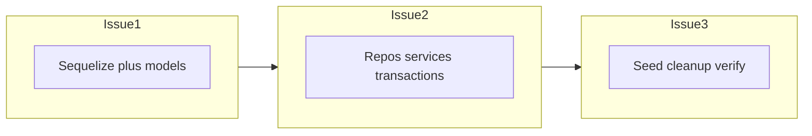

# План ЛР5: ORM на базі [lab4](lab4)

## Що вже є в репозиторії

- **Домен і схема БД** відповідають темі «Онлайн-словник»: [lab4/db/schema.sql](lab4/db/schema.sql) — `languages`, `words` (FK на мову), `dictionaries` (джерело/цільова мова), `translations` (зв’язок словника з парою слів). Це вже дає **зв’язок один-до-багатьох** (наприклад, `Language` → багато `Word`; `Dictionary` → багато `Translation`) без обов’язку вводити окрему junction-таблицю для N:M.
- **Шар доступу до даних**: класи-репозиторії з `query()` у [lab4/repositories/](lab4/repositories/) (`languageRepository`, `wordRepository`, `dictionaryRepository`, `translationRepository`), кожен приймає опційний `client` для транзакцій.
- **Транзакції**: [lab4/db/UnitOfWork.js](lab4/db/UnitOfWork.js) + передача `client` у репозиторії; бізнес-операція **«додати пару слів і переклад атомарно»** — [lab4/services/translationService.js](lab4/services/translationService.js) (`addWordWithTranslationAtomically`).
- **Залежності**: у [package.json](package.json) є `pg`, **немає** `sequelize` — його додасть Issue 1.
- **Ініціалізація даних**: [lab4/db/seed.js](lab4/db/seed.js) зараз на сирих `INSERT`.

Вимоги методички закриваються так: моделі Sequelize віддзеркалюють [schema.sql](lab4/db/schema.sql); для **однієї** сутності (логічно **`Word`**, бо вже повний CRUD у [lab4/services/wordService.js](lab4/services/wordService.js)) явно задокументувати/реалізувати **усі** create/read/update/delete через ORM; **усі** операції створення/оновлення/видалення (адмінські write) обгорнути в `sequelize.transaction()`; бізнес-операцію переписати на `transaction` з автоматичним rollback при винятку; асоціації Sequelize показати на прикладі існуючих FK.

---

## 3 кроки для GitHub Issues (по одному на гілку / відповідальному)

**Порядок злиття:** Issue 1 → Issue 2 → Issue 3. Усередині Issue 2 можна тимчасово розбити підзадачі між учасниками (мови/словники vs слова/переклади), але один PR зменшує конфлікти.

### Issue 1 — Фундамент: Sequelize, підключення, моделі та асоціації

**Зміст (об’єднує колишні кроки 1–2):**

- Додати `sequelize` у [package.json](package.json) (і за потреби `sequelize-cli`, якщо оберете міграції).
- Модуль ініціалізації (наприклад, `lab4/db/sequelize.js` + `lab4/models/index.js`) з тими самими змінними середовища, що й [lab4/db/db.js](lab4/db/db.js).
- Стратегія щодо БД: таблиці вже створюються [lab4/db/schema.sql](lab4/db/schema.sql) — **не** використовувати `sync({ force: true })` на спільній БД; зафіксувати у короткому коментарі в репо.
- Моделі `Language`, `Word`, `Dictionary`, `Translation` за полями зі схеми; мапінг camelCase ↔ snake_case для сумісності з API.
- Асоціації: `Language`↔`Word`, `Dictionary`↔`Language` (source/target), `Dictionary`↔`Translation`, `Translation`↔`Word` (source/target) — відповідно до FK.

**Критерій готовності:** імпорт моделей не падає; smoke-підключення до БД; асоціації зареєстровані без циклічних помилок.

---

### Issue 2 — Шар даних: усі репозиторії та сервіси на ORM, транзакції, CRUD і бізнес-операція

**Зміст (об’єднує колишні кроки 3–5):**

- Переписати на Sequelize: [languageRepository.js](lab4/repositories/languageRepository.js), [dictionaryRepository.js](lab4/repositories/dictionaryRepository.js), [wordRepository.js](lab4/repositories/wordRepository.js), [translationRepository.js](lab4/repositories/translationRepository.js) — єдиний підхід: опційний аргумент `{ transaction }` у методах, де це доречно.
- Сервіси [languageService.js](lab4/services/languageService.js), [dictionaryService.js](lab4/services/dictionaryService.js), [wordService.js](lab4/services/wordService.js), [translationService.js](lab4/services/translationService.js): **create / update / delete** всередині `sequelize.transaction`.
- **Word:** повний CRUD через ORM (вимога методички для однієї сутності).
- **Translation:** `addWordWithTranslationAtomically` на **одній** транзакції Sequelize замість [UnitOfWork.js](lab4/db/UnitOfWork.js); **демонстрація rollback** (тест або контрольований сценарій з помилкою після частини кроків).
- Маршрути без змін контракту: [languageRoutes.js](lab4/routes/languageRoutes.js), [dictionaryRoutes.js](lab4/routes/dictionaryRoutes.js), [wordRoutes.js](lab4/routes/wordRoutes.js), [translationRoutes.js](lab4/routes/translationRoutes.js).

**Критерій готовності:** адмін і користувацькі сценарії працюють; атомарне додавання пари слів + перекладу не лишає часткових змін при помилці; `translate` коректний (за потреби — `include` замість завантаження всіх рядків у пам’ять).

---

### Issue 3 — Seed, прибирання legacy, інтеграція

**Зміст (колишній крок 6):**

- [lab4/db/seed.js](lab4/db/seed.js) через моделі Sequelize (`bulkCreate` / `upsert`, збереження id з [lab4/data/](lab4/data/) за потреби).
- Видалити або залишити лише як thin-wrapper непотрібні [lab4/db/db.js](lab4/db/db.js) та [lab4/db/UnitOfWork.js](lab4/db/UnitOfWork.js), якщо код більше не звертається до `pg` Pool напряму.
- Оновити npm-скрипти за потреби; ручний чеклист: мови, словники, слова, переклади, сторінка перекладу.

**Критерій готовності:** `schema.sql` + seed без сирих `INSERT` у прикладному коді; гілка готова до здачі ЛР5.

---

## Ризики та узгодження для групи

- **Три issues при шести учасниках:** два-три людини на Issue 2 за доменними зонами (наприклад, «мови + словники» / «слова + переклади»), але один спільний PR або жорсткий порядок комітів у гілці, щоб уникнути merge-конфліктів.
- **Зв’язок N:M:** якщо викладач вимагає окремо N:M без поточної таблиці `translations`, це зміна схеми — тоді розширити Issue 1; за поточної схеми достатньо 1:N у моделях і в звіті.
